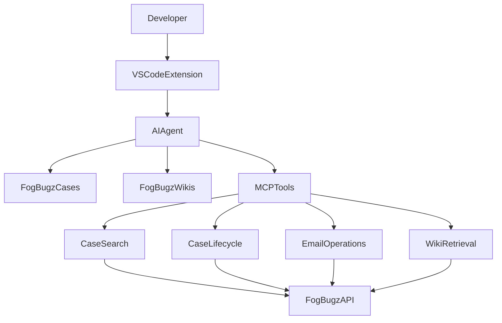

# IVP AI Boost

**IVP AI Boost** is an AI-powered developer productivity extension for Visual Studio Code that integrates directly with FogBugz to deliver intelligent search, structured knowledge retrieval, and automated case lifecycle management.

Built using **Model Context Protocol (MCP)** and a **deep agent architecture**, IVP AI Boost provides a unified AI interface for accessing documentation, investigating issues, and managing support workflows without leaving the development environment.

The extension connects developers to FogBugz cases, wiki documentation, and operational workflows — significantly reducing investigation time and eliminating knowledge silos.

---

# Overview

Enterprise development environments often suffer from fragmented knowledge sources such as bug tracking systems, documentation portals, internal wikis, and API references. Developers frequently spend valuable time switching between multiple tools to investigate issues or find technical information.

**IVP AI Boost solves this by introducing an AI-powered knowledge and workflow layer directly inside VS Code.**

The extension consolidates:

- FogBugz cases  
- Product documentation and wiki articles  
- API documentation  
- Historical investigations  
- Case lifecycle operations  

into a **single intelligent interface** accessible within the editor.

---

# Key Features

## Intelligent Knowledge Search

Search across multiple FogBugz knowledge sources directly from VS Code.

Supported sources include:

- Product documentation and wiki articles  
- REST API documentation  
- Technical implementation references  
- Historical FogBugz cases  
- Projects, areas, and contributors  

The AI assistant automatically determines whether to retrieve information from documentation or historical cases to provide the most relevant and reliable answer.

---

## Issue Investigation

IVP AI Boost significantly accelerates debugging and investigation by enabling developers to:

- Search for known bugs and regressions  
- Match error messages with historical cases  
- Discover recent code changes  
- Identify existing fixes or workarounds  

This reduces duplicate investigations and helps teams resolve issues faster.

---

## Case Lifecycle Automation

Developers can manage FogBugz cases directly from within VS Code.

Supported operations include:

- Creating new cases  
- Assigning or reassigning cases  
- Updating case fields and metadata  
- Resolving or reopening issues  
- Adding investigation notes and comments  

All workflows follow structured validation steps and require explicit confirmation before execution to ensure safe and controlled operations.

---

## Email & Communication Workflow

IVP AI Boost supports case-related communication workflows such as:

- Sending emails from a case  
- Replying to customer emails  
- Forwarding case information  
- Structured communication approvals  

This ensures communication remains consistent, auditable, and fully integrated within the FogBugz case lifecycle.

---

# Architecture

IVP AI Boost uses a **deep agent architecture built on the Model Context Protocol (MCP)**.  
The AI agent interprets user intent, retrieves knowledge from FogBugz systems, and executes structured workflows through MCP tools.

